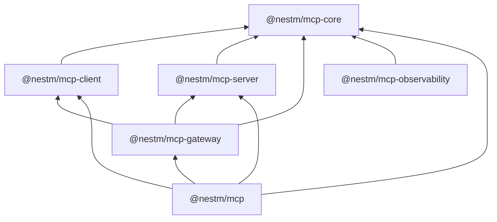

# NestM MCP

NestM MCP is an alpha-stage Model Context Protocol runtime for NestJS applications, gateways, and agent hosts. It builds on the official MCP TypeScript SDK v2 while adding package boundaries for multi-server client operation, per-request servers, Nest dependency injection, middleware, authorization, and observability.

The primary use case is an artifact or agent runtime that needs to expose trusted application capabilities and consume many MCP servers through one controlled NestJS layer. The runtime is intended to make authentication, authorization, routing, lifecycle ownership, and telemetry explicit rather than hiding them behind a global SDK singleton.

> [!WARNING]
> This repository currently targets NestJS `12.0.0-alpha.5`, TypeScript `7.0.2`, MCP SDK `2.0.0`, and Node.js `>=22.13.0`. Every package is `0.1.0-alpha.0`. Expect breaking changes while NestJS 12 and these packages remain alpha.

## Packages

| Package                    | Responsibility                                                                                                                         | Status      |
| -------------------------- | -------------------------------------------------------------------------------------------------------------------------------------- | ----------- |
| `@nestm/mcp-core`          | Framework-neutral operation context, middleware, authorization decisions, and lifecycle observation                                    | Implemented |
| `@nestm/mcp-client`        | Named multi-server official v2 client runtime, transports, typed requests, manual multi-round input, managed listening, and middleware | Implemented |
| `@nestm/mcp-server`        | Framework-neutral per-request server runtime, feature registry, web-standard/Node/stdio serving, and OAuth resource-server wrapper     | Implemented |
| `@nestm/mcp-gateway`       | Tool, prompt, resource, resource-template, and completion projection with policy enforcement and auth-scoped discovery caching         | Implemented |
| `@nestm/mcp-observability` | Backend-neutral structured logging, metrics, tracing, bounded attributes, and redaction policies                                       | Implemented |
| `@nestm/mcp`               | NestJS module, decorators, validated handler pipelines, named client integration, dependency injection, and application lifecycle      | Implemented |

The dependency graph keeps protocol/runtime code below the Nest adapter:



`@nestm/mcp-core` is not a replacement for `@modelcontextprotocol/core`: the NestM package owns runtime composition contracts, while the official package owns raw protocol schemas. Client and server adapters depend only on the official SDK packages they actually use.

## MCP v2 model

The modern `2026-07-28` protocol era is per-request:

- `server/discover` advertises the server instead of opening with `initialize`.
- HTTP requests carry their own `_meta` envelope.
- There is no modern `Mcp-Session-Id` session.
- `createMcpHandler` creates a fresh `McpServer` from a factory for each request.

NestM follows that model. Server features register tools, resources, and prompts on the fresh request instance. Long-lived database pools, registries, caches, and brokers belong in Nest providers or closures outside the factory. The same official handler can serve 2025-era clients in stateless compatibility mode; sessionful legacy transports are an explicit deployment choice rather than the core runtime model.

See [Architecture](docs/architecture.md) for state ownership and protocol-era details.

## Local development

```sh
corepack enable
pnpm install --frozen-lockfile
pnpm run check
pnpm run test
pnpm run verify:pack
```

The workspace uses pnpm `11.20.0`, ESM-only package output, explicit export maps, tsdown, strict TypeScript project references, Vitest, oxlint, Prettier, publint, and Changesets.

## Consume multiple servers

`@nestm/mcp-client` owns one official `Client` per named upstream and applies one logical-operation policy across them:

```ts
import { McpClientRuntime } from "@nestm/mcp-client";

const runtime = new McpClientRuntime({
	servers: [
		{
			name: "artifact-storage",
			transport: {
				kind: "http",
				url: "https://mcp.example.com/storage",
				authProvider,
			},
			clientOptions: { versionNegotiation: { mode: "auto" } },
		},
	],
	middleware: [policyMiddleware, auditMiddleware],
	observer: lifecycleObserver,
});

try {
	await runtime.connect("artifact-storage");
	const tools = await runtime.listTools("artifact-storage");
	console.log(tools.tools.map(({ name }) => name));
} finally {
	await runtime.close();
}
```

Discovery verdicts may be reused through the official SDK's `PriorDiscovery` support, but cache freshness and authorization-context isolation remain the host's responsibility.

The runtime also exposes typed general requests, completion, manual modern `input_required` rounds, and runtime-owned modern `listen()` handles. Manual multi-round APIs return the official continuation instead of invoking configured auto-fulfilment handlers; each resumed leg re-enters runtime middleware and lifecycle observation. Disconnecting an upstream closes its active subscriptions before the official client and transport. The older `resources/subscribe` and `resources/unsubscribe` delegates are explicitly legacy-only.

## Build an artifact or agent gateway

`@nestm/mcp-gateway` projects tools, prompts, concrete resources, resource templates, and completion from named upstream clients into one MCP server. Names and resource routes are reversible and collision-safe, discovery is isolated by authorization context, and the required capability-specific policy runs during listing and again immediately before execution.

```ts
import { Injectable, Module } from "@nestjs/common";
import { McpModule, allowMcpOperation, denyMcpOperation } from "@nestm/mcp";
import type { McpGatewayPolicy } from "@nestm/mcp-gateway";

@Injectable()
class AgentGatewayPolicy implements McpGatewayPolicy {
	authorize: McpGatewayPolicy["authorize"] = (operation) => {
		return operation.input.toolName === "artifact.delete"
			? denyMcpOperation("Destructive tools require a separate approval path.")
			: allowMcpOperation({ policy: "artifact-agent-v1" });
	};

	authorizePrompt() {
		return allowMcpOperation({ policy: "artifact-agent-v1" });
	}

	authorizeResource() {
		return allowMcpOperation({ policy: "artifact-agent-v1" });
	}

	authorizeResourceTemplate() {
		return allowMcpOperation({ policy: "artifact-agent-v1" });
	}
}

@Module({
	imports: [
		McpModule.forRoot({
			collaborators: { providers: [AgentGatewayPolicy] },
			clients: upstreamServers,
			connectClientsOnBootstrap: true,
			servers: [
				{
					name: "agent-gateway",
					serverInfo: { name: "agent-gateway", version: "1.0.0" },
					gateway: {
						upstreams: ["artifact-storage", "knowledge"],
						policy: AgentGatewayPolicy,
					},
				},
			],
		}),
	],
})
export class AgentGatewayModule {}
```

The declarative gateway owns the server-wide tool, prompt, resource, and completion handlers.
Gateway servers are therefore dedicated in this alpha: put local/decorated capabilities on a
separate named server rather than composing semantics that cannot be honored for every projected
capability.

Protect the downstream HTTP handler as an OAuth resource server and keep every upstream credential owned by its client definition. The gateway never forwards the downstream bearer token automatically. Prompt, resource, and resource-template policy hooks are fail closed when omitted, so adding an upstream capability cannot expose it through an existing tool-only policy. In a Nest application, string and `{ clientName }` gateway entries use module-owned named clients as service identities. For delegated, token-exchanged, or user-owned upstream credentials, place a complete `{ name, client: resolver }` entry in the same declarative `gateway.upstreams` array; the resolver receives the verified request context and must return an authorization-isolated client.

Resource-template discovery/read and prompt/template completion are supported. Transparent multi-round `input_required` relaying and upstream-to-downstream notification bridging are not: those require sealed route-bound request state and a long-lived, authorization-partitioned subscription coordinator. Until that coordinator exists, the gateway does not claim list-change or resource-subscription support for projected capabilities.

## Expose Nest providers as MCP capabilities

```ts
import { Injectable, Module } from "@nestjs/common";
import { McpModule, Tool, fromJsonSchema } from "@nestm/mcp";

@Injectable()
class ArtifactTools {
	@Tool({
		name: "artifact.read",
		servers: "artifact-tools",
		inputSchema: fromJsonSchema<{ id: string }>({
			type: "object",
			properties: { id: { type: "string" } },
			required: ["id"],
		}),
	})
	read({ id }: { id: string }) {
		return { content: [{ type: "text" as const, text: id }] };
	}
}

@Module({
	imports: [
		McpModule.forRoot({
			collaborators: { providers: [AgentGatewayPolicy] },
			servers: [
				{
					name: "artifact-tools",
					serverInfo: { name: "artifact-tools", version: "1.0.0" },
				},
				{
					name: "agent-gateway",
					serverInfo: { name: "agent-gateway", version: "1.0.0" },
					gateway: {
						upstreams: ["artifact-storage", "knowledge"],
						policy: AgentGatewayPolicy,
					},
				},
			],
			clients: upstreamServers,
			connectClientsOnBootstrap: true,
		}),
	],
	providers: [ArtifactTools],
})
export class AppModule {}
```

Use `forRootAsync` when client/server definitions come from application configuration:

```ts
McpModule.forRootAsync({
	imports: [RuntimeConfigModule],
	inject: [RuntimeConfigService],
	useFactory: (config: RuntimeConfigService) => ({
		clients: config.mcpServers(),
		connectClientsOnBootstrap: true,
	}),
});
```

The module is local by default. Import `forRoot()` or `forRootAsync()` exactly once per Nest
application and configure every MCP client and server in that shared root. Set `isGlobal: true`
only when application-wide injection is intentional.

After Nest application bootstrap, inject `McpRuntimeService`. Use `runtime.server("artifact-tools")` for the local inbound server, `runtime.clients` or `runtime.client(name)` for configured upstreams, and `runtime.gateway("agent-gateway")` to inspect or invalidate the dedicated server's aggregate discovery cache. Shutdown closes inbound server handlers before closing upstream clients. The Nest destroy hook contains cleanup failures so framework adapter disposal can continue; inspect `runtime.shutdownError` or call `runtime.close()` explicitly when the host must fail on cleanup errors.

Call `app.enableShutdownHooks()` during bootstrap when SIGTERM/SIGINT should trigger Nest lifecycle cleanup. A failed MCP bootstrap automatically rolls back any clients and servers that were already initialized.

Decorated tools, resources, and prompts have a validated, transport-independent callback pipeline:

```ts
McpModule.forRoot({
	collaborators: {
		providers: [
			ArtifactHandlerPolicy,
			DeadlineMiddleware,
			AuditMiddleware,
			ArtifactLifecycleObserver,
		],
	},
	servers: [
		{
			name: "artifact",
			serverInfo: { name: "artifact", version: "1.0.0" },
			handlerAuthorization: ArtifactHandlerPolicy,
			handlerMiddleware: [DeadlineMiddleware, AuditMiddleware],
			handlerLifecycleObserver: ArtifactLifecycleObserver,
		},
	],
});
```

List these collaborator classes under `McpModule`'s `collaborators.providers`. Authorization providers expose
`authorize`, middleware providers expose `handle`, and lifecycle providers expose `onEvent`. The
official SDK validates and routes the request before this pipeline runs. `handlerAuthorization`
cannot be bypassed by custom handler middleware, and `handlerLifecycleObserver` records denials as
well as successes and failures without including callback arguments or results. This is the
correct per-tool/resource/prompt seam for both HTTP and stdio. By contrast, a server's injectable
`middleware` providers surround an HTTP exchange and do not run for stdio.

`@nestm/mcp-observability` supplies backend-neutral lifecycle observers for structured logs and metrics plus tracing middleware. Its default projection includes only bounded protocol dimensions; principals, payloads, request/session IDs, error messages, stacks, and credentials require explicit opt-in.

## Safe defaults

- Core authorization enforcement is fail closed: once installed as middleware, a missing policy, thrown policy, malformed decision, or explicit deny never reaches the terminal handler. Protected runtimes must configure that policy explicitly.
- Nest handler authorization runs after official argument validation and before custom handler middleware for every decorated HTTP or stdio invocation.
- Server operation context omits bearer-token material; observers receive a safe principal projection.
- Lifecycle events omit request and response payloads by design.
- Observer failures do not replace protocol results or primary failures.
- Streamable HTTP URLs are constrained to `http:` or `https:`; production hosts should additionally enforce TLS and an outbound destination allowlist.
- Stdio commands are privileged configuration. Never construct commands or environment variables from an untrusted tool call.
- Modern servers are stateless per request. Session affinity is not silently introduced.
- Client OAuth state belongs to the provider, while server bearer verification belongs to the resource-server boundary.

Read [Security and OAuth](docs/security-and-oauth.md) and [Observability](docs/observability.md) before production deployment.

## Documentation

- [Architecture](docs/architecture.md)
- [Security and OAuth](docs/security-and-oauth.md)
- [Observability](docs/observability.md)
- [Contributing](CONTRIBUTING.md)
- [Security policy](SECURITY.md)
- [Changelog](CHANGELOG.md)

The vendored `references/` directory is research input and is not part of any published package. The official SDK and MCP specification remain authoritative for wire behavior.

## License

BSD-3-Clause
