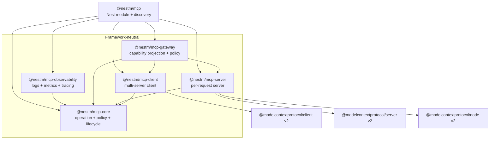
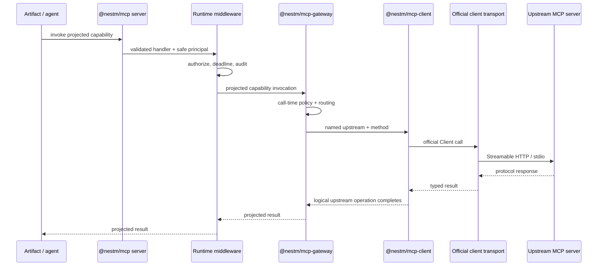

# Architecture

NestM MCP is a layered runtime around the official Model Context Protocol TypeScript SDK v2. The official SDK remains authoritative for wire schemas, negotiation, transports, and protocol behavior; NestM owns application composition, lifecycle, policy, routing, and NestJS integration.

## Design goals

- Keep the protocol-facing client and server independently usable outside NestJS.
- Make operation context, authorization, middleware, and observation reusable across client, server, and gateway roles.
- Preserve the modern MCP v2 per-request model instead of rebuilding hidden server sessions.
- Allow an agent host to connect to many upstreams without sharing clients, credentials, or discovery state accidentally.
- Keep payloads and bearer tokens out of default telemetry.
- Provide explicit seams for transports, policy engines, token providers, caches, brokers, and OpenTelemetry.

## Package graph

Gateway composition remains framework-neutral. A gateway is installed as a server feature, so it can be used by a plain `McpServerRuntime` or included in a Nest server definition without moving protocol behavior into the Nest layer. The Nest facade re-exports the curated gateway and observability APIs, owns its configured multi-server client runtime, and exposes that runtime through `McpRuntimeService.clients`.

### `@nestm/mcp-core`

Core defines immutable operation envelopes, role and operation metadata, onion middleware, fail-closed authorization decisions, and structured lifecycle observation. It intentionally imports neither NestJS nor the official MCP SDK. Client and server adapters translate SDK calls into this shared operation model.

### `@nestm/mcp-client`

The client runtime owns a registry of named upstream definitions and an independent official `Client` and transport for each connected server. It provides:

- Streamable HTTP and Node stdio definitions;
- injectable SDK client and transport factories;
- one logical-operation middleware pipeline across all upstreams;
- typed protocol delegates for tools, resources, prompts, completion, general requests, and manual modern multi-round input;
- runtime-owned modern subscriptions that close before their client connection;
- connection and capability snapshots;
- explicit connect, disconnect, and async-disposal ownership; and
- host-managed prior discovery verdicts.

An upstream name is a routing key, not a security identity. Policies should additionally bind the resolved URL, authorization issuer/resource, and expected server identity.

### `@nestm/mcp-server`

The server runtime owns a named server definition, official HTTP handler, feature factory, lifecycle observer, notifier/event bus, and deterministic shutdown. It exposes web-standard `fetch`, a Node handler adapter, and stdio serving.

A feature registers tools, resources, prompts, or low-level handlers on the fresh official `McpServer` created for a request. Features may close over long-lived application services, but must not treat the request server instance as durable state.

Modern interactive operations use the official `inputRequired` result and retry model. NestM
re-exports the official response readers and signed request-state codec rather than adding a task
abstraction. The 2025 task status value also named `input_required` is unrelated deprecated wire
vocabulary: it is not the modern result type and has no v2 runtime API.

### `@nestm/mcp-gateway`

The gateway composes client and server roles rather than implementing a second protocol stack. Its boundary provides:

- named upstream selection and projection of tools, prompts, concrete resources, resource templates, and completion;
- reversible, collision-safe tool/prompt/template names and concrete/template resource URIs, with protocol length bounds enforced;
- capability-specific authorization filtering during discovery and mandatory authorization immediately before dispatch;
- raw capability-discovery caching partitioned by upstream and authorization context, with TTL, size bounds, singleflight, and bounded pagination;
- a structural client interface plus an adapter for `McpClientRuntime`; and
- middleware and payload-safe lifecycle hooks around discovery and invocation.

It does not forward arbitrary JSON-RPC or downstream bearer tokens. The first-party named-runtime adapter uses the credential configured for that upstream, so named Nest gateway entries are a service-identity model. Delegated identity, token exchange, or user-owned connections require an application-supplied authorization-aware client resolver; Nest accepts that complete framework-neutral upstream beside its shorter named-client entries.

Resource templates and prompt/template completion are projected. Multi-round `input_required` responses and upstream notifications are not transparently bridged. Those require sealed route-bound request state plus long-lived subscription ownership, reconnection, cache invalidation, downstream notifier integration, and authorization-domain partitioning. Until that coordinator exists, the gateway does not claim list-change or resource-subscription support for projected capabilities.

### `@nestm/mcp-observability`

The observability package adapts core operation contracts without selecting a telemetry vendor. It provides:

- bounded, redacted attribute projection;
- lifecycle observers for immutable structured log records;
- lifecycle observers for started/completed counters, active operations, and duration histograms; and
- tracing middleware over small structural tracer/span interfaces suitable for OpenTelemetry or another backend.

Payloads, principals, request/session identifiers, error messages, stacks, and credentials are excluded by default. Application dimensions must be selected explicitly and still pass the bounded projection and sensitive-key policy.

### `@nestm/mcp`

The Nest adapter owns `McpModule.forRoot()`/`forRootAsync()`, named upstream client configuration, discovery, decorators, DI tokens, bootstrap readiness, rollback, and shutdown. Async configuration accepts normal Nest imports/injection and can opt out of the default global module through `isGlobal: false`. Decorator generics preserve the official schema-inferred callback contracts at compile time. Decorated singleton providers with static dependency trees are discovered once; their handlers are registered as a feature on each fresh request server.

A Nest server's optional `gateway` definition resolves short upstream names against the module-owned `McpClientRuntime`, accepts complete context-aware upstream resolvers for delegated identity, builds the framework-neutral gateway feature at bootstrap, and rejects unknown client names before serving traffic. Gateway servers are dedicated in this alpha because official list/call/read handlers and list-change/subscription capability bits are server-wide; Nest rejects decorated local handlers targeting the same server instead of advertising semantics the combined server cannot honor. `McpRuntimeService.gateway(serverName)` retains the operational gateway for cache invalidation and inspection.

Each configured Nest server can define `handlerAuthorization`, `handlerMiddleware`, and `handlerLifecycleObserver`. The official SDK first validates arguments and resolves the registered callback. NestM then builds a handler operation from the trusted callback definition and official server context, runs lifecycle observation, enforces mandatory authorization, runs custom middleware, and finally invokes the provider method. This per-handler pipeline is shared by HTTP and stdio.

Catalog exposure is a projection of that same per-request build, not a second registry. After the
complete visibility wave succeeds, eager, search, or lazy exposure is resolved against one frozen
safe view of the tools visible to that caller. Lazy catalog meta-tools close over only that local
view; they never query the live registry, raw request authentication, or another concurrent build.
All visible tools remain registered through the ordinary callback path, so choosing deferred
discovery does not weaken invocation authorization.

`McpServerDefinition.middleware` is deliberately a different seam: it wraps a complete HTTP exchange before the official handler and therefore does not run for stdio. Use it for exchange-level concerns; use the Nest handler pipeline for tool/resource/prompt authorization and observation.

## Modern per-request serving

The official SDK calls protocol revisions through `2025-11-25` the legacy era and starts the modern era at `2026-07-28`.

| Concern             | 2025 era                               | Modern `2026-07-28` era                   |
| ------------------- | -------------------------------------- | ----------------------------------------- |
| Negotiation         | `initialize` handshake                 | `server/discover` advertisement           |
| Request metadata    | Era-specific request fields            | `_meta` envelope on each request          |
| HTTP state          | May use a hand-wired session transport | Per-request handler; no `Mcp-Session-Id`  |
| Server construction | Often long-lived transport/server      | Fresh server from the factory per request |

`createMcpHandler` also serves legacy traffic in stateless compatibility mode by default. A truly sessionful 2025 deployment must opt into and operate the older transport model explicitly, including session routing, cleanup, resumability, and affinity.

### State ownership

Long-lived state belongs outside the request server factory:

- Nest providers and connection pools;
- the named client and server registries;
- discovery caches with timestamps and authorization-context keys;
- OAuth token and registration stores;
- rate limiters and policy engines; and
- distributed event buses for multi-node subscriptions.

Request-local state belongs in the operation context, abort signal, official request context, and fresh `McpServer` instance. Never use a server instance created by the factory as a cache.

Multi-round HTTP operations are also stateless. Each retry is a new request, re-enters validated
handler authorization and lifecycle middleware, and carries only current-round `inputResponses`
plus optional server-minted `requestState`. State that influences policy must be signed,
short-lived, and bound to method and authorization context; it is not a replacement for a server
session.

Modern HTTP scales behind an ordinary load balancer without session affinity. Cross-node notifications still require a distributed `ServerEventBus`; the official in-process bus cannot publish from node A to a stream held by node B.

Nest shutdown first closes inbound server handlers and only then closes upstream client connections. Both phases still run when the first reports a cleanup failure. Because Nest aborts later adapter disposal when a destroy hook rejects, the lifecycle hook contains the aggregate in `McpRuntimeService.shutdownError`; the explicit `close()` API preserves rejecting cleanup semantics for hosts that need it.

## Operation flow

Inbound HTTP serving applies resource authentication before MCP dispatch. Nest handler authorization and observation then run around the validated tool/resource/prompt callback on either HTTP or stdio. Outbound client authentication is applied by the official transport. A gateway performs both flows but keeps their credentials and policy decisions separate.

## Middleware layers

NestM intentionally exposes more than one layer:

1. **Logical operation middleware** from `@nestm/mcp-core` surrounds client, gateway, or validated Nest handler operations. In `composeMcpMiddleware([a, b], terminal)`, `a` is outermost. A continuation may be called once.
2. **Official client fetch middleware** surrounds every HTTP attempt, including discovery, OAuth, and retries. In the official SDK composition, the last middleware passed is outermost.
3. **Server-definition middleware** surrounds a complete web-standard HTTP exchange. It does not wrap stdio and should not be the only per-capability authorization layer.
4. **Nest handler middleware** runs after official request validation and routing, around decorated tool/resource/prompt callbacks on HTTP and stdio. Mandatory `handlerAuthorization` remains ahead of custom handler middleware.
5. **Framework middleware/adapters** mount the web-standard server handler into Node, Express, Fastify, or another host. They should authenticate and normalize the request before MCP dispatch.
6. **Nest interceptors and guards** remain application concerns and should not be assumed to run for a separately mounted raw Node handler unless the host explicitly routes through Nest's request pipeline.

Operation-specific client and gateway transform helpers are typed adapters over layer 1. They do
not create another execution path: cancellation, deadlines, one-shot continuations, and lifecycle
observation remain owned by the existing chain. Gateway authorization is inserted before user
middleware, so a transform cannot short-circuit a protected invocation before policy runs. The
client runtime places exact transforms downstream of all general middleware, so configured client
authorization middleware also runs before an exact transform regardless of their relative options
order. General client middleware remains caller-ordered within its own group.

Do not place a logical authorization policy only in fetch middleware: stdio and in-memory transports would bypass it. Do not place attempt-level retry metrics only in logical middleware: one operation may produce several network attempts.

## Protocol discovery and gateways

With automatic negotiation, the client probes `server/discover` and can persist the resulting `PriorDiscovery` verdict. Supplying a fresh verdict avoids repeating the probe. Freshness is not enforced by the SDK:

- a stale modern verdict normally fails loudly when incompatible;
- a stale legacy verdict may continue to work silently after an upstream upgrade; and
- a verdict obtained under one authorization context must not be reused for another without policy approval.

The gateway's discovery cache is separate from protocol-era negotiation. It stores raw tool, prompt, concrete-resource, and resource-template discovery by named upstream and opaque authorization context, with explicit TTL, pagination, item, and in-flight bounds. Authorized projections are recomputed on every list or execution request so a policy change is not hidden behind a cached allow decision. The first-party client still owns protocol-era `PriorDiscovery` and its freshness policy.

## Extension points

Existing seams include client/transport factories, client configuration callbacks, server and gateway features, operation and Nest handler middleware, lifecycle observers, authorization policies, request error callbacks, bearer verifiers, discovery caches, telemetry sinks/tracers, and Nest feature providers.

The implemented observability package remains backend-neutral. OpenTelemetry SDK bindings, persistent encrypted OAuth provider state, RFC 8693-style token exchange, distributed event buses/caches, external policy engines, and artifact-specific catalogs can be added as adapters without forcing a telemetry backend, database, identity provider, cache, or Nest deployment shape into core.
