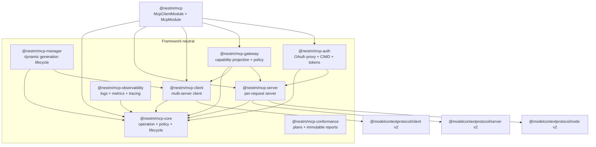
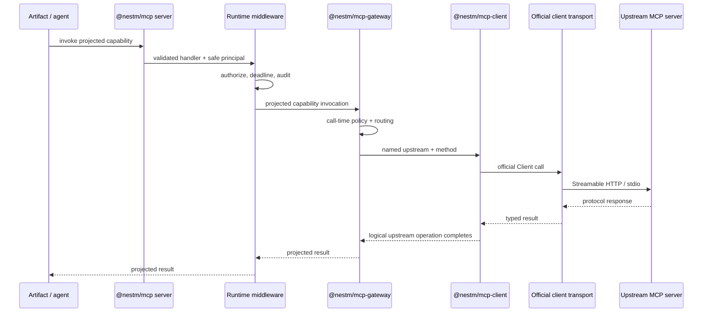

# Architecture

NestM MCP is a layered runtime around the official Model Context Protocol TypeScript SDK v2. The official SDK remains authoritative for wire schemas, negotiation, transports, and protocol behavior; NestM owns application composition, lifecycle, policy, routing, and NestJS integration.

## Design goals

- Keep the protocol-facing client and server independently usable outside NestJS.
- Make operation context, authorization, middleware, and observation reusable across client, server, and gateway roles.
- Preserve the modern MCP v2 per-request model instead of rebuilding hidden server sessions.
- Allow an agent host to connect to many upstreams without sharing clients, credentials, or discovery state accidentally.
- Keep payloads and bearer tokens out of default telemetry.
- Provide explicit seams for transports, policy engines, token providers, caches, brokers, and OpenTelemetry.

## Package graph

Gateway composition remains framework-neutral. A plain `McpServerRuntime` can install a gateway as
a server feature; a Nest application instead uses the declarative server `gateway` option. The
Nest facade intentionally exports its module, decorators, services, and a small set of callback
types rather than mirroring the lower packages. Import gateway, client, server, or observability
APIs directly from their owning package when building outside the Nest adapter.

### `@nestm/mcp-core`

Core defines immutable operation envelopes, role and operation metadata, onion middleware, fail-closed authorization decisions, and structured lifecycle observation. It intentionally imports neither NestJS nor the official MCP SDK. Client and server adapters translate SDK calls into this shared operation model.

### `@nestm/mcp-client`

The client runtime owns a registry of named upstream definitions and an independent official `Client` and transport for each connected server. This package remains framework-neutral: it imports no Nest APIs and retains direct construction and explicit async disposal for non-Nest hosts. It provides:

- Streamable HTTP and Node stdio definitions;
- injectable SDK client and transport factories;
- one logical-operation middleware pipeline across all upstreams;
- typed protocol delegates for tools, resources, prompts, completion, general requests, and manual modern multi-round input;
- runtime-owned modern subscriptions that close before their client connection;
- connection and capability snapshots;
- explicit connect, disconnect, and async-disposal ownership;
- opaque identity-keyed leases with secure close-on-final-release defaults;
- host-managed prior discovery verdicts; and
- a separate strict outbound OAuth surface with exact issuer/resource discovery, endpoint policy,
  PKCE/state transactions, durable pre-dispatch refresh claims, exact-revision commits, and
  bounded refresh ownership.

An upstream name is a routing key, not a security identity. Policies should additionally bind the resolved URL, authorization issuer/resource, and expected server identity.

### `@nestm/mcp-manager`

The manager owns bounded, opaque runtime generations above the client runtime. A host resolves an
opaque generation key into already-admitted transport material; connection records, endpoints,
credentials, tenancy, and persistence stay behind that resolver. Generation leases fence
replacement and retirement while discovery or execution is in flight, and cleanup failures enter a
capacity-charging quarantine instead of being silently forgotten.

### `@nestm/mcp-conformance`

The conformance package is an independent orchestration and evidence boundary. A trusted host
defines an ordered plan against an ephemeral target, runs it under the host's existing lifecycle
lease, and receives a bounded immutable Zod/Standard Schema report. The package provides explicit
side-effect gating, cancellation and time bounds, stable fingerprints, semantic report comparison,
and JSON/JUnit export. It imports no Nest, MCP SDK, client, manager, or product application code.

Connections, transports, credentials, fixture selection, durable history, baseline approval, and
dashboard access policy remain host responsibilities. This separation lets the same plan run in
different builds or containers and compare their reports without swapping library versions inside
one process.

### `@nestm/mcp-server`

The server runtime owns a named server definition, official HTTP handler, feature factory, lifecycle observer, notifier/event bus, and deterministic shutdown. It exposes web-standard `fetch`, a Node handler adapter, and stdio serving.

A feature registers tools, resources, prompts, or low-level handlers on the fresh official `McpServer` created for a request. Features may close over long-lived application services, but must not treat the request server instance as durable state.

Modern interactive operations use the official `inputRequired` result and retry model. NestM
re-exports the official response readers and signed request-state codec rather than adding a task
abstraction. The 2025 task status value also named `input_required` is unrelated deprecated wire
vocabulary: it is not the modern result type and has no v2 runtime API.

### `@nestm/mcp-gateway`

The gateway composes client and server roles rather than implementing a second protocol stack. Its boundary provides:

- named upstream selection and projection of tools, prompts, concrete resources, resource templates, and completion;
- reversible, collision-safe tool/prompt/template names and concrete/template resource URIs, with protocol length bounds enforced;
- capability-specific authorization filtering during discovery and mandatory authorization immediately before dispatch;
- raw capability-discovery caching partitioned by upstream and authorization context, with TTL, size bounds, singleflight, and bounded pagination;
- a structural client interface plus an adapter for `McpClientRuntime`; and
- middleware and payload-safe lifecycle hooks around discovery and invocation.

It does not forward arbitrary JSON-RPC or downstream bearer tokens. The first-party named-runtime adapter uses the credential configured for that upstream, so named Nest gateway entries are a service-identity model. Delegated identity, token exchange, or user-owned connections require an application-supplied authorization-aware client resolver. Framework-neutral callers pass that resolver in a complete gateway upstream; Nest applications register an `McpGatewayClientProvider` and reference its token from the declarative upstream.

Resource templates and prompt/template completion are projected. Multi-round `input_required` responses and upstream notifications are not transparently bridged. Those require sealed route-bound request state plus long-lived subscription ownership, reconnection, cache invalidation, downstream notifier integration, and authorization-domain partitioning. Until that coordinator exists, the gateway does not claim list-change or resource-subscription support for projected capabilities.

### `@nestm/mcp-auth`

The auth package is the framework-neutral OAuth toolkit for MCP servers acting as resource servers or as a scoped authorization-server proxy in front of a real identity provider. It depends only on `@nestm/mcp-core` and `@nestm/mcp-server`, and keeps `@modelcontextprotocol/client`, `@modelcontextprotocol/server`, and `jose` as peer dependencies so a non-Nest host can adopt one capability at a time. The `./cimd` and `./stores` subpaths never import `@nestm/mcp-server`, so a gateway or client host can take Client ID Metadata Document validation or the storage contract alone. It provides:

- a Client ID Metadata Document resolver (SEP-991, the 2026-07-28 replacement for Dynamic Client Registration) with strict URL admission rules, document validation via `@modelcontextprotocol/core`'s schemas, an SSRF-hardened `node:https` fetcher that pins DNS resolution at connect time, positive-only caching, and per-host circuit breaking;
- a bounded, TTL-first token/state storage contract (`McpOAuthStore`) that maps one-to-one onto Redis primitives, plus a memory implementation that rejects rather than evicts at capacity;
- an asymmetric-by-default JWT issuer and verifier (EdDSA/ES256 via `node:crypto`, HS256 for single-node dev) with a JWKS-publishing key ring and algorithm pinning from the resolved key;
- an `OAuthTokenVerifier` for the server's own minted tokens and a `jose`-backed verifier for external authorization servers; and
- a token-free principal-claims projection that reads only the allowlisted claims placed on `AuthInfo.extra`.

The Nest adapter consumes it through the per-server `oauth` option group: `oauth.resource` composes `McpResourceServer` bearer verification and RFC 9728/8414 metadata around the HTTP handler using injected provider tokens, with an optional fail-closed anonymous-access policy.

### `@nestm/mcp-observability`

The observability package adapts core operation contracts without selecting a telemetry vendor. It provides:

- bounded, redacted attribute projection;
- lifecycle observers for immutable structured log records;
- lifecycle observers for started/completed counters, active operations, and duration histograms; and
- tracing middleware over small structural tracer/span interfaces suitable for OpenTelemetry or another backend.

Payloads, principals, request/session identifiers, error messages, stacks, and credentials are excluded by default. Application dimensions must be selected explicitly and still pass the bounded projection and sensitive-key policy.

### `@nestm/mcp`

The Nest adapter exposes two dynamic modules with separate ownership. `McpClientModule.forRoot()` or
`forRootAsync()` owns named upstream configuration and provides `McpClientService`, an injectable
subclass of the framework-neutral `McpClientRuntime`. It resolves callback-bearing client options
from singleton Nest collaborator tokens, optionally connects every upstream during application
bootstrap, rolls back failed connection waves, and owns standalone shutdown. Client-only agent
hosts import this module directly.

`McpModule.forRoot()` or `forRootAsync()` owns inbound servers, discovery, decorators, bootstrap
readiness, gateways, and aggregate shutdown. When an inbound gateway or `McpRuntimeService` needs
named upstreams, the configured `McpClientModule` is included in `McpModule`'s `imports`; clients are
not flattened into the server module's options. Applications import exactly one `McpModule` server
root because decorator discovery is intentionally application-wide. Each module is local by
default, and `isGlobal: true` is an explicit opt-in.

Ordinary Nest modules own decorated capability providers and their imports/exports. Server and
client runtime collaborators are explicitly owned by their respective dynamic module through
`collaborators.providers` and `collaborators.imports`, preserving module isolation and lifecycle
ordering. Decorator generics preserve the official schema-inferred callback contracts at compile
time. Decorated singleton providers with static dependency trees are discovered once; their
handlers are installed on each fresh request server. Low-level extensions are registered as
injectable `McpServerContributor` providers instead of raw feature callbacks in the Nest definition.

That boundary also covers callback-bearing official server options. The Nest server definition uses
tokens for its JSON Schema validator, request-state verifier, and long-lived HTTP event bus; bootstrap
resolves those providers into the raw `getValidator`, `verify`, and `publish`/`subscribe` contracts
expected by `@nestm/mcp-server` and the official SDK. Passive configuration remains ordinary data.
Consequently, application state and lifecycle stay in Nest DI without making the lower server
runtime depend on Nest.

A Nest server's optional `gateway` definition resolves short upstream names against the imported
`McpClientService`. Because that service extends `McpClientRuntime`, the framework-neutral gateway
adapter remains unchanged. For delegated identity, the definition accepts a
`{ name, clientProvider }` descriptor and resolves the referenced singleton provider's
context-aware `resolveClient()` method before building the framework-neutral gateway. Its policy,
name and URI codecs, discovery cache, authorization-context
resolver, middleware, lifecycle observer, and observer-error reporter are likewise singleton
provider tokens. Nest resolves and binds these collaborators once during bootstrap; raw callback
objects remain the direct-construction API of `@nestm/mcp-gateway`. A missing client module, unknown
client, or missing collaborator provider fails during bootstrap. Gateway servers are dedicated in
this alpha because official list/call/read handlers and list-change/subscription capability bits are
server-wide; Nest rejects decorated local handlers targeting the same server instead of advertising
semantics the combined server cannot honor. `McpRuntimeService.gateway(serverName)` retains the
operational gateway for cache invalidation and inspection.

Each configured Nest server can reference singleton providers through `handlerAuthorization`,
`handlerMiddleware`, and `handlerLifecycleObserver`. The official SDK first validates arguments and
resolves the registered callback. NestM then builds a handler operation from the trusted callback
definition and official server context, runs lifecycle observation, enforces mandatory
authorization, runs custom middleware, and finally invokes the provider method. This per-handler
pipeline is shared by HTTP and stdio.

Catalog exposure is a projection of that same per-request build, not a second registry. A singleton
policy provider's `resolve()` method selects eager, search, or lazy exposure against one frozen safe
view after the complete visibility wave succeeds. Lazy catalog meta-tools close over only that
local view; they never query the live registry, raw request authentication, or another concurrent
build. All visible tools remain registered through the ordinary callback path, so choosing
deferred discovery does not weaken invocation authorization.

Framework-neutral `McpServerDefinition.middleware` is deliberately a different seam: it wraps a
complete HTTP exchange before the official handler and therefore does not run for stdio. A Nest
server references injectable middleware providers for the same layer. Use it for exchange-level
concerns; use the Nest handler pipeline for tool/resource/prompt authorization and observation.

## Modern per-request serving

The official SDK calls protocol revisions through `2025-11-25` the legacy era and starts the modern era at `2026-07-28`.

| Concern             | 2025 era                               | Modern `2026-07-28` era                   |
| ------------------- | -------------------------------------- | ----------------------------------------- |
| Negotiation         | `initialize` handshake                 | `server/discover` advertisement           |
| Request metadata    | Era-specific request fields            | `_meta` envelope on each request          |
| HTTP state          | May use a hand-wired session transport | Per-request handler; no `Mcp-Session-Id`  |
| Server construction | Often long-lived transport/server      | Fresh server from the factory per request |

`createMcpHandler` also serves legacy traffic in stateless compatibility mode by default. A truly sessionful 2025 deployment must opt into and operate the older transport model explicitly, including session routing, cleanup, resumability, and affinity.

### State ownership

Long-lived state belongs outside the request server factory:

- Nest providers and connection pools;
- the named client and server registries;
- discovery caches with timestamps and authorization-context keys;
- OAuth token and registration stores;
- rate limiters and policy engines; and
- distributed event buses for multi-node subscriptions.

Request-local state belongs in the operation context, abort signal, official request context, and fresh `McpServer` instance. Never use a server instance created by the factory as a cache.

Multi-round HTTP operations are also stateless. Each retry is a new request, re-enters validated
handler authorization and lifecycle middleware, and carries only current-round `inputResponses`
plus optional server-minted `requestState`. State that influences policy must be signed,
short-lived, and bound to method and authorization context; it is not a replacement for a server
session.

Modern HTTP scales behind an ordinary load balancer without session affinity. Cross-node notifications still require a distributed `ServerEventBus`; the official in-process bus cannot publish from node A to a stream held by node B.

Standalone `McpClientModule` shutdown closes its owned runtime and contains destroy-hook failures in
`McpClientService.shutdownError`. When the client module is imported through `McpModule`, the
aggregate runtime takes shutdown ownership: it closes inbound server handlers, then gateways, then
upstream client connections. Every phase still runs when an earlier phase reports a cleanup failure.
Because Nest aborts later adapter disposal when a destroy hook rejects, the aggregate hook contains
the error in `McpRuntimeService.shutdownError`; the explicit `close()` API preserves rejecting
cleanup semantics for hosts that need it.

## Operation flow

Inbound HTTP serving applies resource authentication before MCP dispatch. Nest handler authorization and observation then run around the validated tool/resource/prompt callback on either HTTP or stdio. Outbound client authentication is applied by the official transport. A gateway performs both flows but keeps their credentials and policy decisions separate.

## Middleware layers

NestM intentionally exposes more than one layer:

1. **Logical operation middleware** from `@nestm/mcp-core` surrounds client, gateway, or validated Nest handler operations. In `composeMcpMiddleware([a, b], terminal)`, `a` is outermost. A continuation may be called once.
2. **Official client fetch middleware** surrounds HTTP attempts made through the configured client transport, including its SDK-managed discovery, pass-through OAuth, and retries. In the official SDK composition, the last middleware passed is outermost. The dedicated `@nestm/mcp-client/oauth` facade is separate: it uses only its host-supplied guarded fetch and must not be routed through arbitrary transport or logging middleware.
3. **Server-definition middleware** surrounds a complete web-standard HTTP exchange. It does not wrap stdio and should not be the only per-capability authorization layer.
4. **Nest handler middleware** runs after official request validation and routing, around decorated tool/resource/prompt callbacks on HTTP and stdio. Mandatory `handlerAuthorization` remains ahead of custom handler middleware.
5. **Framework middleware/adapters** mount the web-standard server handler into Node, Express, Fastify, or another host. They should authenticate and normalize the request before MCP dispatch.
6. **Nest interceptors and guards** remain application concerns and should not be assumed to run for a separately mounted raw Node handler unless the host explicitly routes through Nest's request pipeline.

Operation-specific client and gateway transform helpers are typed adapters over layer 1. They do
not create another execution path: cancellation, deadlines, one-shot continuations, and lifecycle
observation remain owned by the existing chain. Gateway authorization is inserted before user
middleware, so a transform cannot short-circuit a protected invocation before policy runs. The
client runtime places exact transforms downstream of all general middleware, so configured client
authorization middleware also runs before an exact transform regardless of their relative options
order. General client middleware remains caller-ordered within its own group.

Do not place a logical authorization policy only in fetch middleware: stdio and in-memory transports would bypass it. Do not place attempt-level retry metrics only in logical middleware: one operation may produce several network attempts.

## Protocol discovery and gateways

With automatic negotiation, the client probes `server/discover` and can persist the resulting `PriorDiscovery` verdict. Supplying a fresh verdict avoids repeating the probe. Freshness is not enforced by the SDK:

- a stale modern verdict normally fails loudly when incompatible;
- a stale legacy verdict may continue to work silently after an upstream upgrade; and
- a verdict obtained under one authorization context must not be reused for another without policy approval.

The gateway's discovery cache is separate from protocol-era negotiation. It stores raw tool, prompt, concrete-resource, and resource-template discovery by named upstream and opaque authorization context, with explicit TTL, pagination, item, and in-flight bounds. Authorized projections are recomputed on every list or execution request so a policy change is not hidden behind a cached allow decision. The first-party client still owns protocol-era `PriorDiscovery` and its freshness policy.

## Extension points

Existing seams include framework-neutral client/transport factories and client configuration
callbacks; Nest provider-token adapters for client factories, transports, authentication, fetch,
middleware, observers, resolvers, clocks, and caches; Nest provider-token adapters for server schema
validation, request-state verification, event buses, and gateway policies, codecs, caches, resolvers,
middleware, lifecycle observation, and observer-error reporting; framework-neutral server and
gateway features; operation and Nest handler middleware; lifecycle observers; authorization
policies; request error callbacks; bearer verifiers; discovery caches; telemetry sinks/tracers; and
Nest contributor providers.

The implemented observability package remains backend-neutral. OpenTelemetry SDK bindings, persistent encrypted OAuth provider state, RFC 8693-style token exchange, distributed event buses/caches, external policy engines, and artifact-specific catalogs can be added as adapters without forcing a telemetry backend, database, identity provider, cache, or Nest deployment shape into core.
